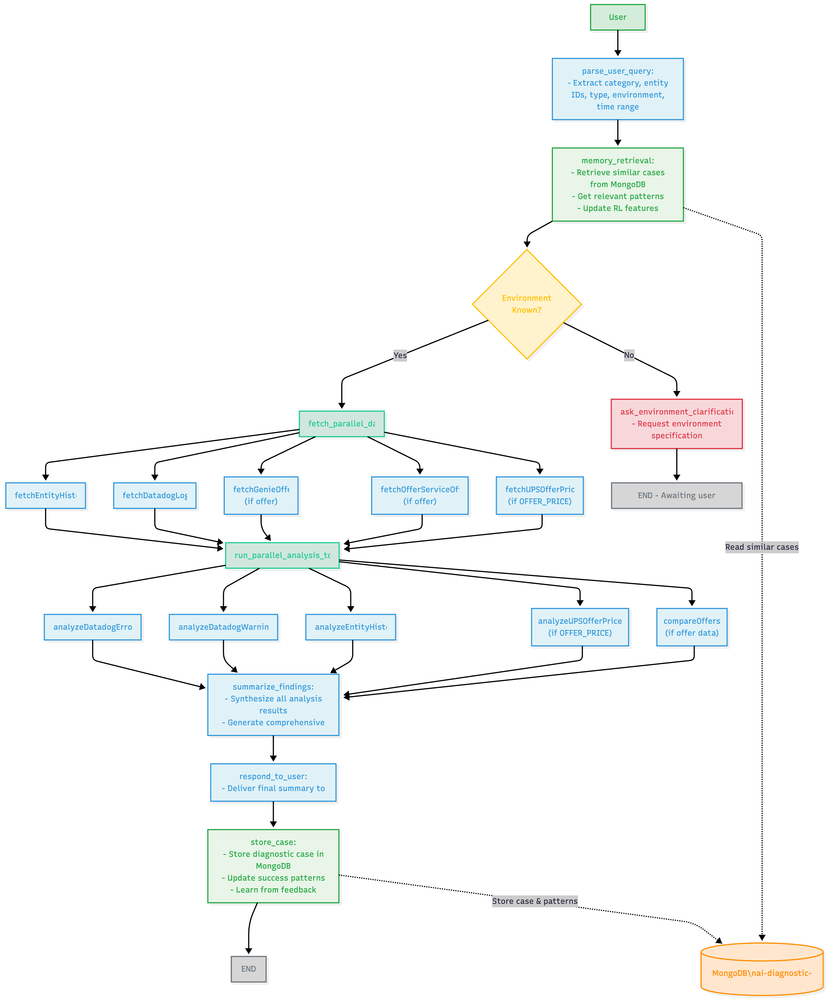

# AI Diagnostic Assistant for Streaming Platform

## Overview

This project is an AI-powered diagnostic assistant designed for a streaming platform. It specializes in identifying and troubleshooting issues related to entities such as offers, campaigns, products, and packages. The assistant helps employees resolve problems stemming from configuration, publishing, or other operational factors within the internal entity creation tool.

## Features

- **Entity Diagnostics**: Analyze issues with offers, campaigns, products, and packages.
- **Log Analysis**: Utilize tools like `getMockDatadogLogs` for detailed log investigation.
- **Workflow Automation**: Execute diagnostic workflows to identify root causes efficiently.
- **Clear Explanations**: Provide concise and actionable insights to users.

## Diagnostic Workflow



The workflow follows these steps:

1. **Understand the User's Problem**: Listen to the user's description of the suspected issue.
2. **Identify Key Information**: Extract relevant details such as entity IDs, entity type, and timeframes.
3. **Strategize Tool Use**: Determine the best tools for investigation based on the gathered information.
4. **Execute Tools**: Use tools to collect necessary data, iterating as needed.
5. **Analyze Findings**: Synthesize data to identify patterns, anomalies, or errors.
6. **Provide Clear Diagnosis**: Explain the root cause or suggest further steps if the issue cannot be pinpointed.

## Installation

1. Clone the repository:
   ```bash
   git clone git@github.com:jeremycod/ai-dd-agent.git
