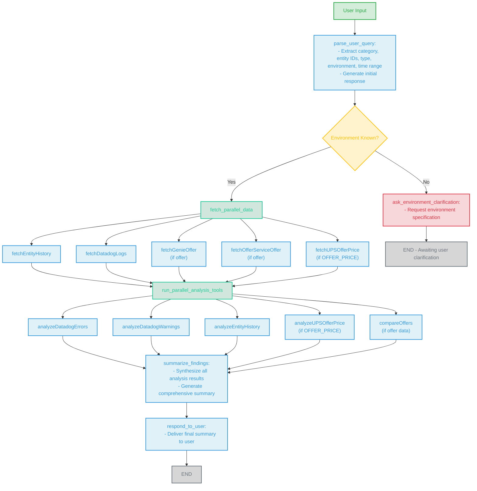

# AI Diagnostic Assistant Workflow Diagram

```mermaid
---
config:
  layout: dagre
---
flowchart TD
    A["User Input"] --> B["parse_user_query:
      - Extract category, entity IDs, type, environment, time range
      - Generate initial response"]
    B --> C{"Environment Known?"}
    C -- Yes --> D["fetch_parallel_data"]
    C -- No --> E["ask_environment_clarification:
      - Request environment specification"]
    
    D --> D1["fetchEntityHistory"] & D2["fetchDatadogLogs"] & D3["fetchGenieOffer
    (if offer)"] & D4["fetchOfferServiceOffer
    (if offer)"] & D5["fetchUPSOfferPrice
    (if OFFER_PRICE)"]
    
    D1 --> F["run_parallel_analysis_tools"]
    D2 --> F
    D3 --> F
    D4 --> F
    D5 --> F
    
    F --> F1["analyzeDatadogErrors"] & F2["analyzeDatadogWarnings"] & F3["analyzeEntityHistory"] & F4["analyzeUPSOfferPrice
    (if OFFER_PRICE)"] & F5["compareOffers
    (if offer data)"]
    
    F1 --> G["summarize_findings:
      - Synthesize all analysis results
      - Generate comprehensive summary"]
    F2 --> G
    F3 --> G
    F4 --> G
    F5 --> G
    
    G --> H["respond_to_user:
      - Deliver final summary to user"]
    E --> I["END - Awaiting user clarification"]
    H --> J["END"]
    
    style A fill:#D4EDDA,stroke:#28A745,stroke-width:2px,color:#28A745
    style B fill:#E0F2F7,stroke:#3498DB,stroke-width:2px,color:#3498DB
    style C fill:#FFF3CD,stroke:#FFC107,stroke-width:2px,color:#FFC107
    style D fill:#D1E7DD,stroke:#20C997,stroke-width:2px,color:#20C997
    style E fill:#F8D7DA,stroke:#DC3545,stroke-width:2px,color:#DC3545
    style D1 fill:#E0F2F7,stroke:#3498DB,stroke-width:2px,color:#3498DB
    style D2 fill:#E0F2F7,stroke:#3498DB,stroke-width:2px,color:#3498DB
    style D3 fill:#E0F2F7,stroke:#3498DB,stroke-width:2px,color:#3498DB
    style D4 fill:#E0F2F7,stroke:#3498DB,stroke-width:2px,color:#3498DB
    style D5 fill:#E0F2F7,stroke:#3498DB,stroke-width:2px,color:#3498DB
    style F fill:#D1E7DD,stroke:#20C997,stroke-width:2px,color:#20C997
    style F1 fill:#E0F2F7,stroke:#3498DB,stroke-width:2px,color:#3498DB
    style F2 fill:#E0F2F7,stroke:#3498DB,stroke-width:2px,color:#3498DB
    style F3 fill:#E0F2F7,stroke:#3498DB,stroke-width:2px,color:#3498DB
    style F4 fill:#E0F2F7,stroke:#3498DB,stroke-width:2px,color:#3498DB
    style F5 fill:#E0F2F7,stroke:#3498DB,stroke-width:2px,color:#3498DB
    style G fill:#E0F2F7,stroke:#3498DB,stroke-width:2px,color:#3498DB
    style H fill:#E0F2F7,stroke:#3498DB,stroke-width:2px,color:#3498DB
    style I fill:#D6D6D6,stroke:#6C757D,stroke-width:2px,color:#6C757D
    style J fill:#D6D6D6,stroke:#6C757D,stroke-width:2px,color:#6C757D
```